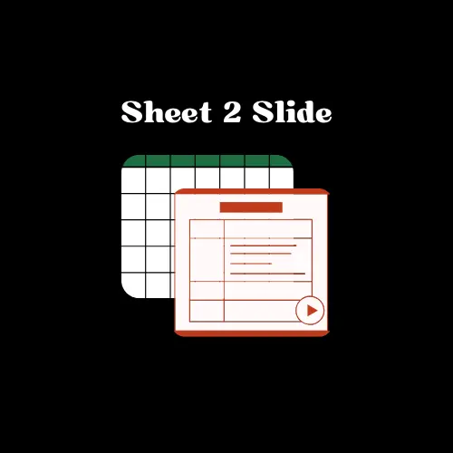

# sheet-to-slide

This is a simple project to run on your device to convert long tables into beautiful PPTx slides!

## Libraries used
- Apache POI
- OpenCSV
- SLF4J
- Log4J 2

## Prerequisites
- JDK
- Apache Maven
- IDE - preferably Intellij IDEA

## Features
- **Powerpoint format (.pptx)** supported.
- **Dynamically** add rows to slide based on Table:Slide ratio mentioned. (Default: 0.6 , i.e. 60% of slide height will be occupied by Table).
- CSV parsing using OpenCSV.
- Logger added for better understanding of flow.
- Error cases implemented (No Setup File, No CSV file, etc.)

## How to Use
- Clone the repo: `git clone clone-url`
- Add your **CSV** files in `src/main/resources/input-folder-name` folder.
- Set the config details in `resources/setup.properties` file.
  - Input Folder Name
  - Output Folder Name
  - Header 
    - Title 
    - Subtitle
  - Footer 
    - Title
    - Subtitle
- Use IDE (Intellij IDEA supported) to run the `SheetToSlideApp.java` file.
- Your Powerpoint slides are ready in seconds!
- Output stored in `src/main/resources/output-folder-name` folder.

## Tracklist
- [x] Run by passing just input & output folder
- [x] Add Header
- [x] Add Footer
- [x] Set Config JSON
- [x] Exceptions support
- [ ] Inbuilt CSV Parser
- [ ] Unit Tests
- [ ] E2E Tests
- [ ] CLI commands 
- [ ] JSON support
- [ ] Google Slides support
